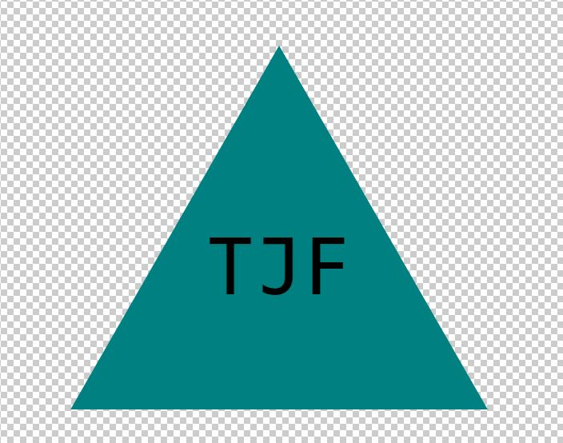

# SVG Logo Maker 

## Project Description

The Module 10 Challenge objective was to build a Node.js command-line application that takes in user input to generate a logo and save it as an SVG file. The application prompts the user to select a color and shape, provide text for the logo, and save the generated SVG to a .svg file.

## Walkthrough Video

[Walkthrough Link](https://drive.google.com/file/d/1H4gOdIctAbwVP-LK8pEvqKsmXc_PEGRw/view?usp=sharing)

## Deployment Screenshot

## Comments

- Prompts user through a series of questions using Inquirer.
- Creates a logo.svg file that contains a 300x200 pixel image that matches the criteria that user has entered.
- Allows user to choose between a circle, square, or triangle for the background shape.
- Allows user to choose colors for both the text and the shape using a color keyword or hexadecimal number.

## Credits

- Project was completed by Travis Fowlston.

## License

- This application is covered under the [MIT License](https://opensource.org/licenses/MIT).
